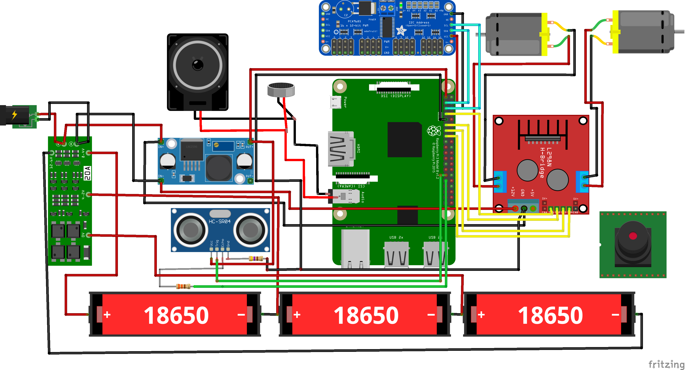
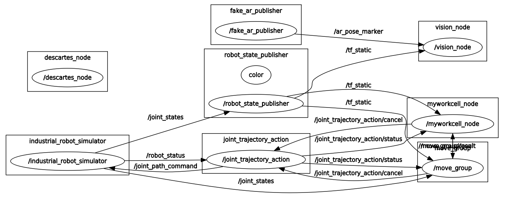
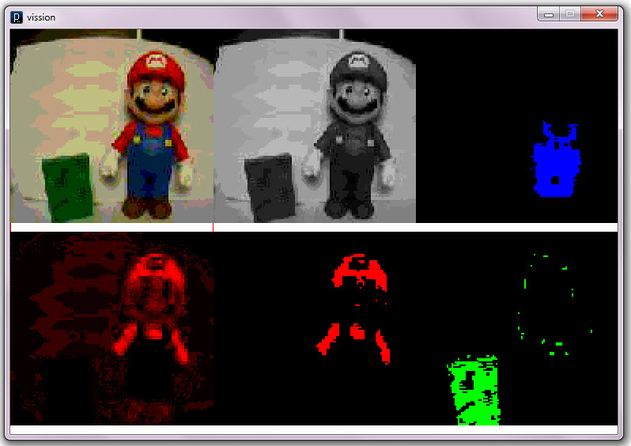

# Техническое зрение автономного мобильного робота на основе цветовой сегментации

Нужно тут накидать план какой-то примерный потмоу что мне кажеться я завтра нихуч не буду вообще помнить и соображать по теме. 
Предположительное название статьи. До того как начать что-то писать надо ещё раз прочесть всё то говнище которое я сегодня прсото нашёл, иначе это будет в 10 раз дольше.

План

1. Вводная про актуальность создания подобных роботехнических систем, создание мобильных сервисных и других автономных роботов способных действтвовать без оператора используя машинное зрения. Дубль на английском, походу это говно может в 2 раза длиннее быть чем надо

2. Про электомеханическую часть, что вот есть такие и такие датчики для ориентации робота в пространстве, связанны они с друг другом вот так, ядром системы является микрокомпьютер разбери пай 4, обарбатывающий данные с датчиколм, анализирующих их и формипрующий управляющие сигналы. Сюда надо добавить илюстрацию с принципиальной схемой, либо тупо схему из фритзинга пихнуть, но мне кажется это такое себе будет

3. Про ROS, чем он так хорош, почему популярен, почему мы выбрали именно его, и как он нам помог сделать робота. Сюда можно приложить граф отношений между нодами в системе. Типа вот такого. Больше особо сказать нечеге, похвалить и пойти дальше.

4. И про саму систему технического зрения, на каких принципах построенна, почему изспользуется палитра hsv а не просто rgb (ну потому что с точки зреняи обработки изображений компьюетру удобнее работать именно с такой). Сюда следовало бы подставить такую картинку, на которой отображается какая картинка считывается камерой, как потом она обрабатывается, по какому принципу идёт выделение нужного цвета (формирование маски и поехали). Должно получится на выходе что-то вот такое

Над списком литературы надо ещё подумать, надо всё таки сослаться на что-то более менее по теме и побольше, я не знаю как это лучше сделать, надо подумать будет, думаю будем дальше читать и перечитывать статьи и что-то найдём.