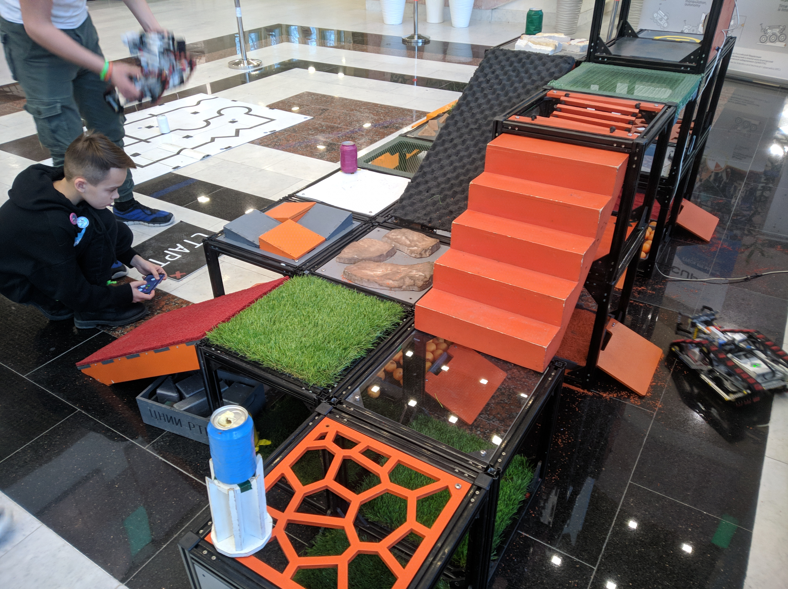

# Проработка концепции проведения (или участия) соревнований роботов

## Октябрь
Сначала общая информация по всем найденным нвоостям о проходивших соревнованиях по робототехнике(октябрь):

1. https://primgazeta.ru/news/dumayuschie-podvodnye-roboty-sorevnuyutsya-vo-vladivostoke-03-09-2018-06-14-51 - классные плавающие роботы во Владивостоке

2. https://nstar-spb.ru/news/sri_petersburg/v_ramkakh_foruma_novye_kadry_opk_proshli_studencheskie_sorevnovaniya_tankovogo_biatlona_robotov_robo/ - какой-то роботлон, что-то связанное с ОПК, но без дат без планов и без ничего

3. http://edurobots.ru/2017/06/innopolis-robotics-olimpiad/ - роботехническая олимпиада в инополисе, одна из самых интересных находок, много треков есть чем кзанятся, есть даже водная робототехника и студенческая секция с более серьёзными роботами (скорее всего с ковидом загнулась)

4. https://controleng.ru/innovatsii/chempionaty-robotov/ - обзорная статья на направления соревнований роботов и красивый pdf в догонку)

5. http://baumanec.bmstu.ru/2019/12/chempionat-robotov/ - статья о том как проходили соревнования по робототехнике в мгту 

6. http://edurobots.ru/2021/09/wro-future-engineers/ - немного о результатах олимпиады по робототехнике проводимой в инополисе

7. https://blog.rcdetails.info/gonki-na-kopterah-chto-eto-takoe-s-chego-nachat/ - гонки дронов в fpv, очень много разных соревнований.

### Полезные информационные ресурсы (октябрь):
1. http://edurobots.ru/ - новости рробототехники и иногда информация о проводимых соревнованиях, достаточно часто выходят новости, не то чтобы очень интересно, но мониторить что происходит в мире роботехнике можно.

2. https://robofinist.ru/event - то же самое по сути, но есть информация о локальных соревнованиях(не интересна нам в целом, ну разве что потом на нём о своих соревнованиях разместить сообщение, ну пусть будет тут), немного странноватый сайт.

### Итоговый список всех интересных соревнований (октябрь):
1. https://www.robofest.ru/ - москвоский фестиваль на вднх,скорее всего ему тоже кранты, поддерживается фондом Дерипаски, а у него там обыски в Нью-Йорской квартире плюс ковид, так что, я думаю, ему сейчас не до роботов.

2. https://eurobot-russia.org/ - международные соревноания по роботехнике, точно живой и у него всё хорошо, в папке с правилами можно ознакомится с регламентом, супер подробные и комплексные правила, надо вникать, ну как бы это уровень очень высокий.

3. https://yandex.ru/profi/courses2020/robotics - направление олимпиады я профессионал посвящённое робототехнике, имеет очень странную манеру, у них есть много теоритической части, на своих вебинарах они показывают какие-то довольно сложные вещи по расчёту кинематики роботов, ну это сильно.

4. https://robolymp.ru/ - соревнования в инополисе, много направлений, в том числе и морские роботы. С 2019 года больше не проводились, будет смысл посмотреть, когда кончится ковид, может быть очнутся.

На видео ниже можно при желании ознакомится с тем, в каком режиме проходили соревнования и прикинуть их уровень, самым интересным и сложным является евробот, там крутые команды, крутые роботы, но надо сначала что-то попроще.

1. https://youtu.be/jh6rTyCoBPQ - Что такое евробот как это работает примерно, опять же это уже финал и тд
2. https://youtu.be/A-X_nLEKpMI - Ещё немного про евробот
3. https://youtu.be/HGTOS_A80c0 - про олимпиаду я профессионал (часть 1)
4. https://youtu.be/fNCwvz9GPvw - это база это знать надо  (я профессионал, жуткая какая-то матеша, интересно конечно, но не совсем то что нужно)
5. https://youtu.be/lUKm0jnH_TI - Ещё про инополис немного, вот там и треков много и весело, но загнулось скорее всего.

## НОЯБРЬ

Удалось найти намного больше потенциально интересных вещей. Подробные правила и более структурированные виды соревнований.

Начать можно с робосумо, прикольная тема, жаль что в основной своей массе в России она существует только с дебильными роботами из LEGO. Я думаю, что это не институский уровень, и нам надо хотя бы делать этих роботов для суммо на ардуинах или стм (кому что ближе, или дальше хз). Дисциплина в мире довольно популярная, не такая задроченная, простите за выражение, как гонки по линии, и намного более эффектная. 

Прикладываю 2 ссылки на видео с демонстрацией того как это всё происходит, первое будет супер японское и супер дикое, а второе так поскромнее:
    
1. https://youtu.be/QCqxOzKNFks - дикая заруба
2. https://youtu.be/GIv4jWB2158 - посиделка с пацанами(как у нас и будет, 3д-печатные кубки для победителей прилагаются)

Теперь подробнее о сайтах с инфой и правилах.

### Список сайтов с правилами и пояснениями
Нашёл супер сайт, российской спартакиады роботов (http://vsr.rus-robots.ru/). На нём можно найти список множества дисциплин, по которым проводятся соревнования, таких как: 

    1. Робо сумо - то о чём мы говорим сейчас
    2. Нейро сумо - супер странная фигня, лучше и не гуглите
    3. Линия, Линия с препятствиями - ну такое
    4. Гуманоид спринт - человекоподобные роботы должны пройти какое-то расстояние
    5. Робо Сортировка - очень близкая по специфике к заданию на евробот в 2021 году.
    6. Сложная дорога - просто полоса препятсвий, но как прсото так и сложно, очень интересное направление

На каждый из видов соревнований там есть довольно подробная инструкция(кроме нейро сумо). С пркавилами конкретно робо сумо можно ознакомится тут, или файл выкачать http://rus-robots.ru/data/documents/RSA-Sumo-2015.pdf. Есть по идее более подробные по каждому конкретному треку (мини, микро, мега).

Кстати полный список партнёров робофеста (Тот что Дерипаска), вот тут есть https://www.robofest.ru/sorevnovaniya/. Можно потом на досуге ещё почитать, но там тоже инфы мало, она вся очень рваная и я хз. Информацию об этом соревновании вот тут нашёл кста https://www.robofest.ru/sorevnovaniya/robotchallenge/. 

Единственный минус в том что всё это давным давно заглохло и уже минимум 1-2 года никаких звуков нет.

### Другие соревнования

1. Трудная дорога(http://rus-robots.ru/data/documents/150114-Reglament-sorevnovaniy.doc). Если коротко то это соревнования кто быстрее проедет полосу препятсвий, есть на роботов какие-то ограничения и тд, но в целом каждый чё хочется мастерит, управлятся как угодно и так далее, мне нравится, видимо единственным правилом является то что организаторы заранее рассказывают какая будет трасса иначе пройти её будте нереально (там бассейн а мы гусеничного робота сделали и тд).

2. Соревнования в стиле donkeycar, очень интересно но может быть дороговато, но это прям вообще ништяк, та самая вещь которой мы с Даниилом занимались на отборочных на хакатон, с правилами все +- уже знакомы, там единственная проблема в том что комплектующие для робтов будут дороже стоить, а так, шикарно. Это и масшинное зрение, и ИИ, и мехатроника с робототехникой и нейронные сети и скорость с экшеном, ну короче круто. Мне бы лично больше всего хотелось бы именно такие, потому что это модно стильно и молодёжно, и мы в России чуть ли не первым вузом таким бы могли бы стать, кто такие соревнования провёл. Есть вот такая рускоязычная статья с описанием что вообще приосходит, если интересно https://habr.com/ru/company/ods/blog/513604/.

Во всех вариантах нужено прикинуть стоимость создания робота, но какой бы мы не выбрали больше 10 тысяч рублей это стить не будет точно никак. Самое дешёвое это робот сумаист, затем идёт навернео трудная дорога, хотя не факт, там шасси может быть дорогим, и самый дорогой, но он же самый интересный это гонки машинок donkeycar (Там действительно нет ничего особенно сложного, было бы желание).

